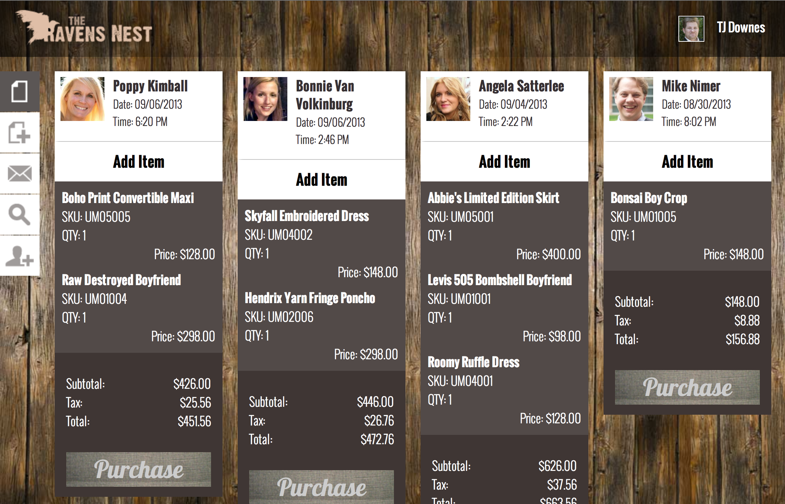
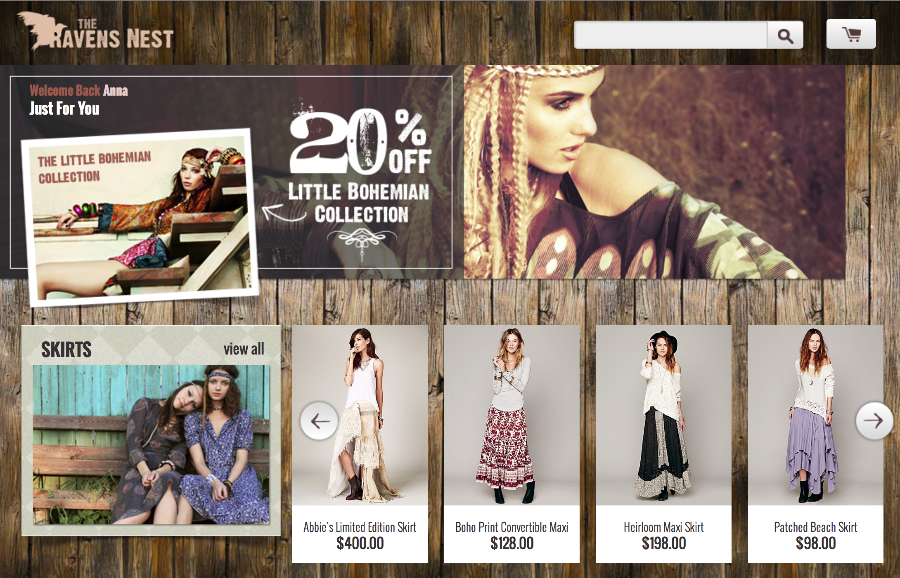
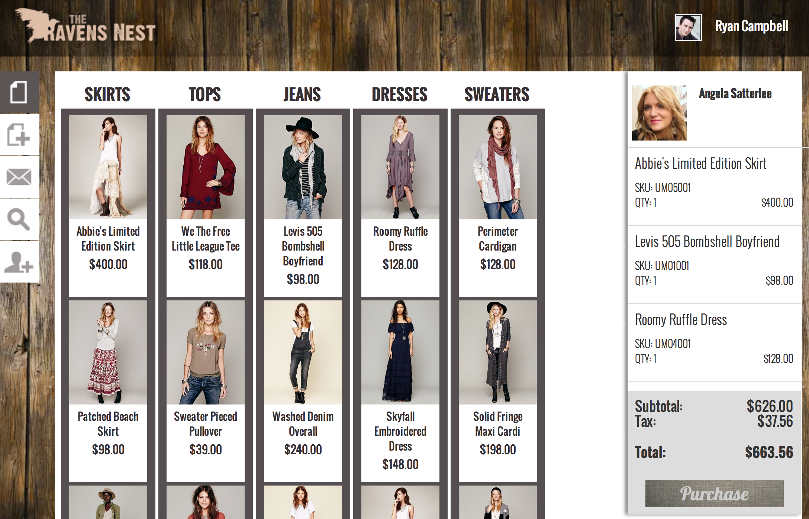

# Clover Clothing Example Application
___

This example is made up of two separate applications. These applications work together to allow customers to select clothes online and try them on in the store. This is important because not being able to try on clothing is often sited as a primary reason why customers fail to convert online. The first is the **Clerk** application that we envision would live in the dressing room or carried around the store by an employee.



The second application is the the **Customer** application which showcases the possible integration with an existing online website. When users visit the website, instead of purchasing the clothes they would select the "Try on in store" option. This will flag the order and make it viewable in the clerk application. Once it appears in the clerk application, an employee can pull the clothes and have them ready for the customer when they arrive at the store.





## Requirements: 
These applications use [Grunt](http://gruntjs.com/) and [NPM](https://npmjs.org/) build tools to compile and package up the application. The application themselves are HTML5 applications built with with [SASS](http://sass-lang.com/) stylesheets and the [AngularJS](http://angularjs.org/) framework. To interact with the Clover REST API, we are using a [NodeJS](http://nodejs.org/) Server as a proxy server for cross domain requests.


### Before you begin. 
1. [Install Node](http://nodejs.org/download/) locally, this will give you the NPM tool.
2. [Install Grunt](http://gruntjs.com/installing-grunt) with NPM.
3. Clone or Fork the Github project to a local directory. 
4. From the command line, or terminal window, go into the "/clothing" directory in the project.
5. Type **npm install** - this will install all of the dependencies required by the application.
6. Type **grunt server** - this will compile and bundle the application. And it will start the nodeJs server and open your default browser to view the application.  This will also watch the example applications files.  If you change the HTML, JS, or CSS - it will recompile the code and refresh the browser automatically.


## Application Structure
The clothing applications use the AngularJS framework and has been broken up into separate _modules_ for each of the main screens in the application. This should allow you to easily make modifications and changes without breaking other areas of the application.  There is also a set of common files, the _Clover API services_, the _Models_, and the _Directives_.

**Tip:** For more information on code organization in an Angular application, Cliff Meyers from Universal Mind has written a [great blog post](http://cliffmeyers.com/blog/2013/4/21/code-organization-angularjs-javascript) on the subject.


### Modules
In each module (screen) you will find 4 files in the folder. There is the _index.js_  file which is the Angular definition for the module. This file will define the correct $routeProvider for this module and the correct controller for this module. The second file in each folder is the _&lt;name&gt;Controller.js_ file which is the AngularJS controller for the module view. The third file is the _&lt;name&gt;.tpl.html_ file which is the HTML template for this module view. The fourth and final file is the _ _&lt;name&gt;.scss_ file which is the SASS Stylesheet file for the module.

When the application is compiled, all of the scss files are merged into a single CSS file. The imported stylesheets are all defined in the root _app.scss_ file. If you create a new module, you will need to add an @import to this file too.

Along with the css, when the application is compiled the html templates and javascript will also be compiled into a single JS file. Now the application would only need to download and cache a single js file, decreasing download times and increasing performance for your application.  The modules are linked into the application, in the root _app.js_ file. Like the css, when you create a new module you will need to link it to the application in the _app.js_ file.


#### Clothing Customer Modules
**/clothing-customer/cart**: This module is the shopping cart view in the application. Users will get to this screen by clicking on the cart icon in the header or by clicking on one of the "add to cart" buttons in the store. The Clover Services used are:
> 1.  _OrderService_ to load the current order
2. _OrderService_ to set the "HOLD-TRYON" note, this is the special flag that the Clerk application looks for all open orders to know which orders are ready for them to pull clothes.
3. _OrderService_ to cancel, or delete, the order.
4. _OrderService_ to remove single items from the order
5. _ProductService_ to load the information about each individual product. This call goes through the _ProductModel_ to make sure it gets the extra information and to load from cache if it can.

**/clothing-customer/category**: This module will show you all of the products in a category. Users will get to this application from the home page when they click on "view all" for a specific category. The Clover services used are:
> 1. _ProductModel_ to load all of the products in a category with the _InventoryService_.

**/clothing-customer/home**: This is the default home screen that shows all of the products, grouped by category.
> 1.  _ProductModel_ uses the _InventoryService_ to load all of the products and categories

**/clothing-customer/login**: For this example, we don't ask for username/password. Instead when the application opens we have a simple drop down of pre-defined customers.
> 1. _CustomerService_ to get the "Logged in" customer.
2. _OrderService_ to get, or create, an active order for the customer.

**/clothing-customer/main**: This is the main entry point for the application and defines the header and ng-view area.

**/clothing-customer/product**: This is the product detail screen that uses the Clover product data and the merged data. The Clover services used are:
> 1. _InventoryService_ to load the selected product from Clover.
2. _ProductModel_ to merge the the Clover data with the mock data for a single product.
3. _OrderService_ to add individual items to the customers active order

**/clothing-customer/try-in-store**: This is the final screen in the flow to inform customers that their order will be ready when they arrive.  It also shows them the location of the store. We are using the [LeafletJS](http://leafletjs.com/) library for maps.


#### Clerk Modules
**/clothing-clerk/customer**: This is the detail view for a single customer. The Clover services used are:
> 1. _CustomerService_ to load the details for the customers.
2. _OrderService_ to load the active order, or create a new one if one does not already exists.
3. _OrderService_ to delete individual items from the order.

**/clothing-clerk/customers**: This is the primary screen of the application that will load all of the customers with open orders. Also this will set the flag (using the note property) to "HOLD-TRYON" so that the clerk application knows the nature of the order. The Clover Services used are:
> 1. _CustomerService_ to get all active customers
2. _OrderService_ to get open orders for each of the customers.

**/clothing-clerk/login**: This view is the login popup that is shown when the application is loaded, this allows different employees to use the application. The application is personalized for each employee; however, the customer data is always the same for all employees. There are no Clover services used in this module.

**/clothing-clerk/main**: This is the main view that starts the application and controls the header, menu, and main ng-view area for the application. There are no Clover services used in this module.

**/clothing-clerk/products**: This is the "Add Items" view of the application that will allow an employee to add additional items to the customer's order. The Clover services used are:
> 1. _ProductModel_ to load all of the products and categories with the _InventoryService_. 
2. _CustomerService_ to load the selected users order.


### Directives
In the Clothing application there is one Angular directive used _/common/directives/ScrollLeftDirective.js_. This Directive is used to control the scrolling area in the _/clothing-customer/home_ module.


### Services
In the _/common/clover-api_ folder you will find simple services for all of the Clover API methods that are needed in this application. The services methods will return an AJAX request object that will allow you to add event listeners for the success or error methods provided (Example #1). An alternative technique is also supported, you can pass into the service methods success and error callback functions which will be invoked when data is returned. Additionally, these service methods will take care of constructing the URL correctly so they can use the NodeJS proxy server.

At times, especially when we need to chain methods together to get a final result, we will use the $q.defer() method to return data. See Example #3 below for an example of invoking this method.


**Invoke example 1**: using an inline success and error method.

```javascript
orderService.getOrder().success(function(data, status, headers, config){
	// do something with the result.
}).error(function(data, status, headers, config){
	// do something with the error.
});
```

**Invoke example 2**: Using Callbacks

```javascript
var successHandler = function(data, status, headers, config){
	// do something with the result.
}
var errorHandler = function(data, status, headers, config){
	// do something with the error
}
orderService.getOrders( successHandler, errorHandler );
```

**Invoke example 3**: Using deferred, when used.

```javascript
orderService.getOrCreateOrderForCustomer().then(function(data){
	// do something with the result.
});
```


### Models
In the _/common/models_ folder you will find Model classes that are used throughout the application. In these Model classes we have defined **Mock** data that is merged with the data pulled from the Clover API.  This Mock data was defined to provide us with the extra metadata about products and customer that we might need. In a real application this might be stored in a corporate CRM, for customers, or a PIM system, for product data.

It should be straight forward for you to replace the Mock data in these applications with remote calls to your own system(s) to get the real data required for the application.

The two clothing applications only have one model.
> 1._/models/ProductModel.js_ - This Model is used to store the extra product data, such as description, friendly name, and product image names.


## NodeJS Server
To enable cross domain requests from our application to the Clover API, we have setup a simple NodeJS server in the _/server/app.js_ folder. This server is started by the **gunt server** command and will start with a default port of 8080 or use _process.env.PORT_ if it has been defined.

